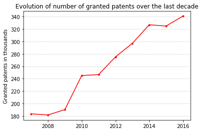
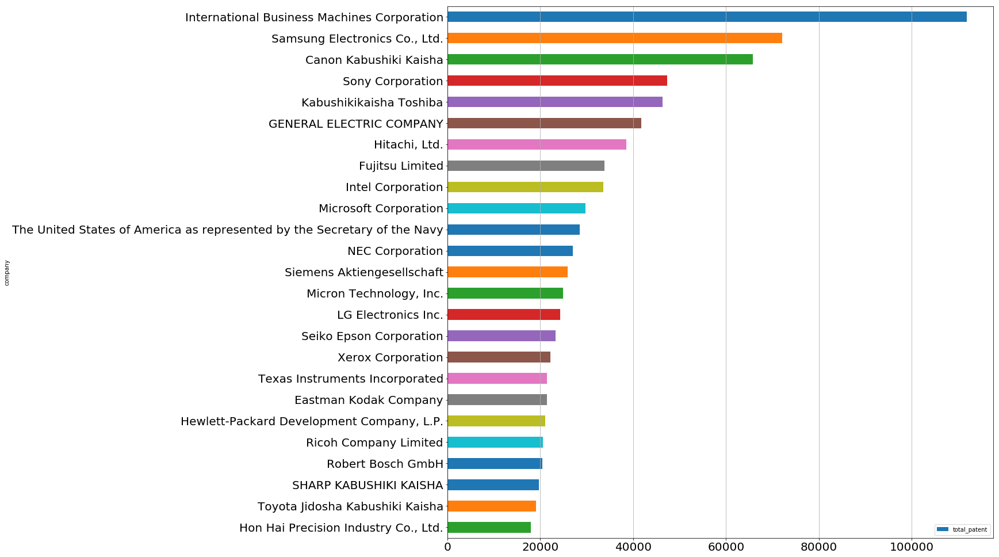
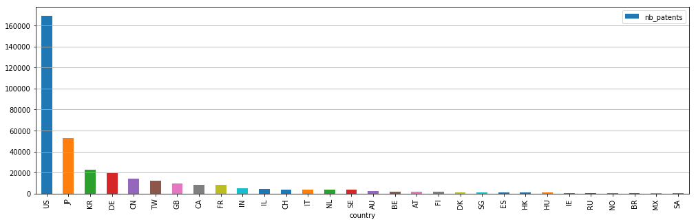
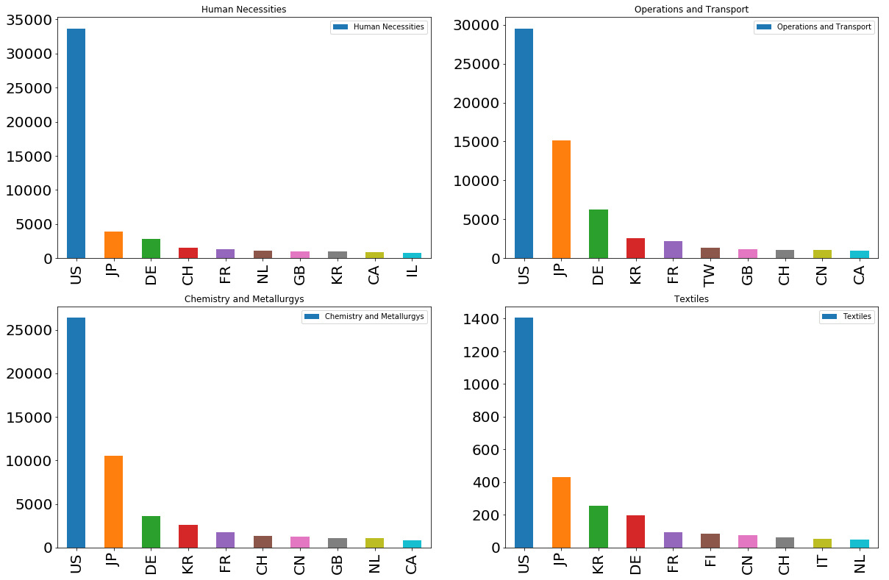
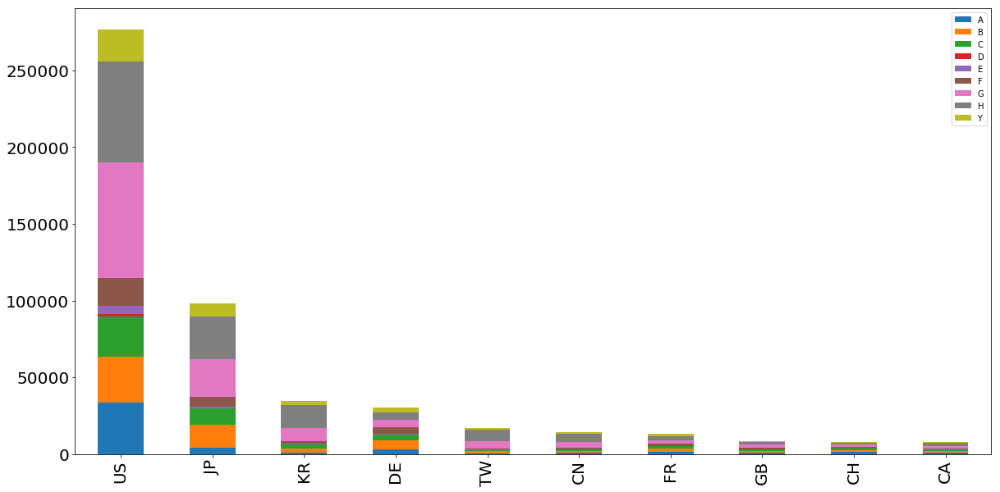

# Patent Applications Analysis

# Introduction

The idea behind our project is extracting meaningful and valuable insights about research trends around the world and shed some light on technology trends related to certain sectors by analyzing granted patents throughout years. In first part of the project, we start by giving some summary and statistics about patents by countries and companies. We wanted analyze the evolution of granted patents over time with the purpose of extracting meaningful informations relative to different sectors. In the second part of the project, we are aiming to dive deeper in analysis and explore some of the most popular technology related sectors in this century. More specifically, the sector we are interested in are energy, financial technologies and artificial intelligence.
Most part of the project is structured around these three sectors. We study them comprehensively in order to understand their evolution in the time and relations with companies and countries.

# Dataset

The dataset that we used in this study is acquired from [PatentsView](http://www.patentsview.org). PatentsView provides an highly convenient API that allowed us to search for patents according to many different criteria such as to a patent title, inventor or locations. For instance, it is possible to look for how many patents in a specific topic were delivered by IBM in California from 2012 and 2015.

In addition to PatentsView dataset, we used various other resources to get certain required informations for the second part of our analysis such [defence industry rankings](http://people.defensenews.com/top-100/) from Defense News  and the [list of top technology companies](http://fortune.com/2015/06/13/fortune-500-tech/). from Fortune.

# Tools and Libraries

We want to briefly mention about main tools and libraries that we used for the project. Programming language we used was Python since it has all of the required libraries needed to conduct this study. Some of the libraries we used can listed as follows: [Pandas](https://pandas.pydata.org) which provides high-performance, easy-to-use data structures and data analysis tools, [Matplotlib](https://matplotlib.org) which is a plotting library that can produce high quality figures in a variety of formats across platforms, [Seaborn](https://seaborn.pydata.org) which is a more advanced Python visualization library based on Matplotlib, [Beautiful](https://en.wikipedia.org/wiki/Beautiful_Soup_(HTML_parser)) Soup which is a package to for scraping and parsing HTML and XML documents and [Folium](https://folium.readthedocs.io/en/latest/#) which is a Python library to manipulate interactive [Leaflet](http://leafletjs.com) maps.

It also needs emphasizing that we've used [Jupyter Notebook](http://jupyter-notebook.readthedocs.io) as the main development environment since it a highly convenient way of creating and sharing documents that contain live code, equations, visualizations and narrative text.

# Methodology

The project can be separated into two parts. In the first part, we conducted a more general research to be able to see the overall picture related to granted patents. We tried to analyze the characteristic of granted patents by observing number of patent through years and associating them with countries and companies. We also give a generic sector-wise overview of granted patens (according to Cooperative Patent Classification categories).

In the second part of the project, we aimed to dive deeper into analysis and explore some of the most popular technology sectors in today's world. The sector we examined can grouped as energy, financial technologies and artificial intelligence. Most part of the project is structured around these three sectors. We study them comprehensively in order to understand their evolution in the time and relationship with companies and countries.

It is important to note that all the given numbers refers to granted patents approved by the USPTO (United State Patent and Trademark Office) and therefore, the statistics highlighted do not cover all patent applications around the world, but since USPTO is the most popular patent company, we believe that our study can produce accurate results.

## 1. General Picture of Granted Patents

## 1.1. Evolution of Granted Patents in Years

In the first step, we wanted display the evolution of granted patents during the last decade in order to see the general trend. Since, the API cannot return more than 100'000 patents in one request, we needed to collect the number of patents month by month and aggregated the results by years. The resulting line graph can be seen in the following figure.

*Figure 1: Number of Granted Patents through Years*

It is clear from this figure that granted patents has dramatically surged in numbers. This situation is expected since the amount of researches has also increased all over the world in 21st century and continue to do so.

## 1.2. Company-wise Analysis of Patents

Next, we were curious about which companies has delivered most patents. We aim to display the top companies in terms of number of patents that they published. Luckily, PatentsView provides the total number of patents that a companies have delivered in their entire lifespan and therefore, it was not required to iterate through years to get these statistic. However, the way it works is that number of patents belongs to a certain company can only be acquired if we encounter a patent that belongs to that specific company. For this reason, we tried to iterate through couple of years and hoped to encounter at least a patent published by each of the different companies. Results were convincing since we get all the important patent provider companies that we anticipated to get.

*Figure 2: Number of Granted Patents Belonging to Companies*

As we can see International Business Machines Corporation (IBM) is the leading company by holding more than 120'000 patents, followed by Samsung Electronics (75'000) and Canon (65'000).

## 1.3. Country-wise Analysis of Patents

After companies, we moved into analysis according to countries. We acquired countries by examining inventors. It was the case that multiple inventors might be involved in a a given patent and these inventors might be located in different countries and so, we go through each inventor's country and increased the patent number belonging to this country by 1. It is also important to mention that for the initial analysis, we only examine the patents granted in the last year. (A more detailed investigations are conducted in the later stages of this project.)

*Figure 3: Number of Granted Patents in the Last Year by Countries*

We also wanted to visualize these findings in a choropleth world map to highlight dispersion granted patents across the countries. In PatensView dataset, country names are coded according to the Alpha-2 ISO norm and to be able to draw the map, it is required a .geojson file that maps these country codes into actual locations. For this purposes, we used take [this](LINK REQUIRED) .geojson file and customized for our purposes.

As it can be seen from [Figure 3](#last_year_patents_by_country), there is a very large gap between countries in terms of number of patents and to be able to have a more descriptive choropleth map, we opted for a logarithmic scale. The resulting map can be seen in the following screenshot and we served the interactive visualization of this map in [here](html/patents_by_country.html).

*Screenshot 1: The map of Number of Granted Patents in the Last Year*

## 1.4. Analysis of Patents belonging to Countries by CPC Categories

The Cooperative Patent Classification (CPC) is patent categorization model which has been jointly developed by the European Patent Office (EPO) and the United States Patent and Trademark Office (USPTO).

CPC categories are indicated in the following table. In this part of our project, we analyzed countries by number of patents granted according these categories.

| **CODE** | **DESCRIPTION**   |
|------|------|
|   **A**  | Human Necessities|
|   **B**  | Operations and Transport|
|   **C**  | Chemistry and Metallurgy|
|   **D**  | Textiles|
|   **E**  | Fixed Constructions|
|   **F**  | Mechanical Engineering|
|   **G**  | Physics|
|   **H**  | Electricity|
|   **Y**  | Emerging Cross-Sectional Technologies|

*Table 1: Patent Categories according to Cooperative Patent Classification*

As we did in the previous section, we started the analysis by gathering patents granted within the last year. For each of these patents, we also acquired belonging country and CPC category code. With help of these two information, we were able to determine top countries for each category. Resulting graphs are as follows.

*Figure 4: Number of Granted Patents in the Last Year according to CPC Categories with Bar Charts*

As it can be seen, we draw only some of the figures because of space concerns but, figures belonging to all categories can be reached from our [notebook](LINK REQUIRED). Almost for all of these categories United States and Japan take the 1st and 2nd however as for the 3rd place, Switzerland, South Koreas or Germany took over in according to different CPC categories. To be able to see all of these ranking in a single figure, we decided to draw a stacked bar chart which is demonstrated in Figure 5.

*Figure 5: Number of Granted Patents in the Last Year according to CPC Categories with a Stacked Chart*

Although this figure seems similar to [figure we draw](#last_year_patents_by_country), it is not the case since for some patents, it might be the case that they belong to multiple CPC categories.

At this point, we wanted display these results in a more descriptive way that can reveal more insights related to patent characteristics of countries. We figured that spider charts can serve this purpose quite nicely. Again, we draw figures only for certain countries (United States, Japan, Germany and Switzerland) and the rest can be reached from our [notebook](LINK REQUIRED).

*Figure 6: Number of Granted Patents in the Last Year according to CPC Categories with Spider Charts*

This figures reveal that Japan and the United States hold most of their patents in the Electricity and the Physics sectors while Switzerland's patents are more concentrated on Chemistry, Humans Necessities and Physics. Germany seems to hold significant number of patents in Transportation sector.
It is clear from these charts that Germany and Switzerland are much more polyvalent than United States and Japan since they have highly diversified patents across many of the CPC sectors.

With that, we conclude the first part of the project and move into more advanced analysis with sector specific investigations.

## 2. Sector-Specific Analysis of Granted Patents
