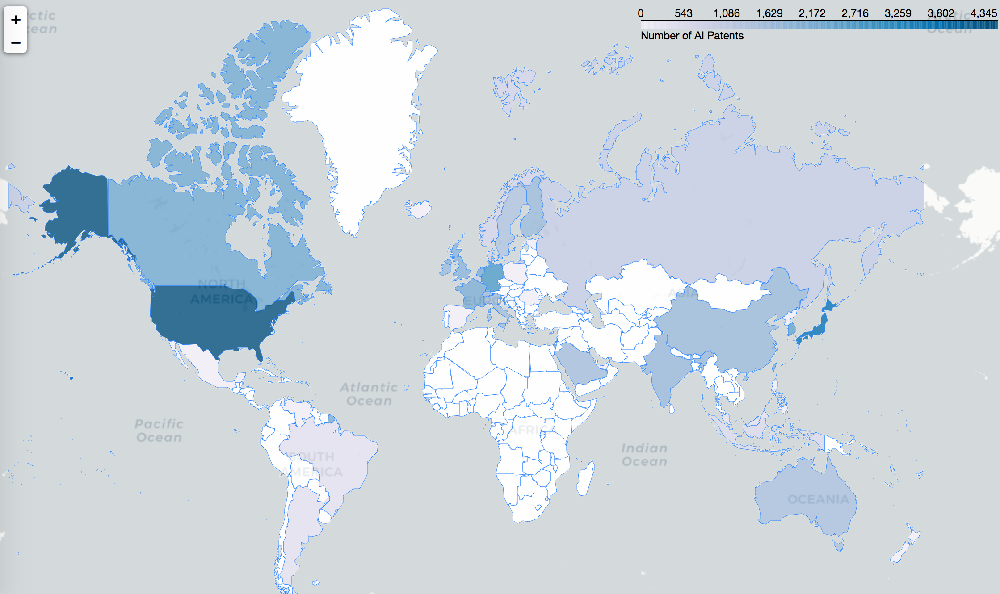

# Introduction

The purpose of our project is to extract valuable insights about research trends around the world and shed some light on popular technologies by analyzing granted patents throughout years. In first part of the project, we start by giving certain summary and statistics about patents according to countries and companies. We analyze the evolution of granted patents over time with the purpose of extracting meaningful informations relative to various sectors. In the second part of the project, we dive deeper into the analysis and explore some of the most popular technology sectors of this century: Energy, FinTech and Artificial Intelligence. Most part of the project is structured around these three sectors. We study them comprehensively in order to understand their evolution over time.

# Dataset

The dataset used in this study is acquired from [PatentsView](http://www.patentsview.org). PatentsView provides an highly convenient API that allowed us to search for patents according to many different criteria such as to a patent title, inventor or locations. For instance, it is possible to look for how many patents in a specific topic were delivered by IBM in California from 2012 and 2015.

In addition to PatentsView dataset, various other resources were used to get certain required informations for the second part of the analysis such as [defence industry rankings](http://people.defensenews.com/top-100/)[2] Defense News  and the [list of top technology companies](http://fortune.com/2015/06/13/fortune-500-tech/)[3] from Fortune.

# Tools and Libraries

This section briefly mention about main tools and libraries used for the project. Programming language used was Python since it has all of the required libraries needed to conduct this study. Some of the libraries can be listed as follows: [Pandas](https://pandas.pydata.org) which provides high-performance, easy-to-use data structures and data analysis tools, [Matplotlib](https://matplotlib.org) which is a plotting library that can produce high quality figures in a variety of formats across platforms, [Seaborn](https://seaborn.pydata.org) which is a more advanced Python visualization library based on Matplotlib, [Beautiful](https://en.wikipedia.org/wiki/Beautiful_Soup_(HTML_parser)) Soup which is a package to for scraping and parsing HTML and XML documents and [Folium](https://folium.readthedocs.io/en/latest/#) which is a Python library to manipulate interactive [Leaflet](http://leafletjs.com) maps.

[Jupyter Notebook](http://jupyter-notebook.readthedocs.io) was used as the main development environment since it contains a highly convenient way of creating and sharing documents. This developing tool contains live code, equations, visualizations and narrative text.

# Methodology

The project can be separated into two parts. In the first part, a more general research is conducted to be able to see the overall picture of granted patents. The characteristic of granted patents was studied by observing their numbers through years and associate them with countries and companies. A sector-wise overview of granted patens (according to Cooperative Patent Classification categories) is provided in this study.

In the second part of the project, a deeper analysis on the most popular technology sectors in today's world is conducted. The sector of interest are grouped as energy, financial technologies and artificial intelligence. Most part of the project is structured around these three sectors. Their evolution over the time and relationship with companies/countries is reviewed in this section.

It is important to note that all the given numbers refers to granted patents approved by the USPTO (United State Patent and Trademark Office) and therefore, the statistics highlighted do not cover all patent applications around the world. However, USPTO is the most popular patent company in the word, therefor we believe our study can produce accurate results.

## 1. General Picture of Granted Patents

## 1.1. Evolution of Granted Patents in Years

In the first step, the evolution of granted patents during the last decade is displayed in order to see the general trend. The resulting line graph can be seen in the following figure.

*Figure 1: Number of Granted Patents over the last decade*

It is clear from this figure that granted patents has dramatically surged in numbers. This situation is expected since the amount of researches has also increased all over the world in 21st century.

## 1.2. Company-wise Analysis of Patents

The following figure shed light on companies which have high number of patents.

*Figure 2: Number of Granted Patents Belonging to Companies*

As we can see International Business Machines Corporation (IBM) is the leading company by holding more than 120'000 patents, followed by Samsung Electronics (75'000) and Canon (65'000).

## 1.3. Country-wise Analysis of Patents

In this part, patents application classified by countries is studied. It is possible that multiple inventors are involved in a given patent. Moreover, these inventors might be located in different countries. Therefore, went through each inventors in a patent and assigned one point for a country if at least one inventor belongs to this country. It is also important to mention that for the initial analysis, we only examine the patents granted in the last year.

*Figure 3: Number of Granted Patents in the Last Year by Countries*

The following map displays the dispersion of patents applications around the world

*Map 1: Map of Granted Patents in 2016*

## 1.4. Analysis of Patents belonging to Countries by CPC Categories

The Cooperative Patent Classification (CPC) is a patent categorization model which has been jointly developed by the European Patent Office (EPO) and the United States Patent and Trademark Office (USPTO).

CPC categories are indicated in the following table.

| **CODE** | **DESCRIPTION**   |
|------|------|
|   **A**  | Human Necessities|
|   **B**  | Operations and Transport|
|   **C**  | Chemistry and Metallurgy|
|   **D**  | Textiles|
|   **E**  | Fixed Constructions|
|   **F**  | Mechanical Engineering|
|   **G**  | Physics|
|   **H**  | Electricity|
|   **Y**  | Emerging Cross-Sectional Technologies|

*Table 1: Patent Categories according to Cooperative Patent Classification*

In that section, patents are studied by CPC sectors and sorted by top countries. The analysis highlight the granted patent within the last year. Resulting graphs are as follow:

*Figure 4: Number of Granted Patents in the Last Year according to CPC Categories with Bar Charts*

Only some of the figures were drawn because of space concerns. All the figures can be reached from our [notebook](LINK REQUIRED). Almost for all of these categories United States and Japan take the 1st and 2nd place. Switzerland, South Koreas or Germany took the 3rd place according to different CPC categories. To be able to see all of these ranking in a single figure, a stacked bar chart is plotted (Figure 5).

*Figure 5: Number of Granted Patents in the Last Year according to CPC Categories with a Stacked Chart*

To reveal more insights related to patent characteristics, spider charts were used to shed the light on which country is focus on which sector. Below, some figures for certain countries of interest are displayed (United States, Japan, Germany and Switzerland). The rest can be obtained from our [notebook](LINK REQUIRED).

*Figure 6: Number of Granted Patents in the Last Year according to CPC Categories with Spider Charts*

This figures reveal that Japan and the United States hold most of their patents in the Electricity and the Physics sectors while Switzerlands patents are more concentrated on Chemistry, Humans Necessities and Physics. Germany seems to hold significant number of patents in Transportation sector.
It is clear from these charts that Germany and Switzerland are much more polyvalent than United States and Japan since they have highly diversified patents across many of the CPC sectors.

## 2. Sector-Specific Analysis of Granted Patents

This part aims to study the evolution of granted patents by sector of interest (Energy, Fintech and AI).

To retrieve the patents from the Patentsview database, keywords and IPC symbols are used. IPC symbols allows to classify patents from different sector. For example the IPC symbol F01B 3 (F = Mechanical engineering, lighting, heating, weapon, 01 = Machines or engines in general, B = Steam engines, 3 = Reciprocating-pison machines or engines with cylinder axes). Keywords allows us to confirm that the patent technology from IPC correspond exactly to what we are looking for.

In order to help us to find the IPC symbols corresponds to which sector, the website http://www.wipo.int/classifications/ipc/en/ is used. IPC symbols are searched separately to confirm they match with our sector criterium.

## 2.1 Energy Patents Analysis

Energy is a high-end sector that changed significantly over the years. The renewable energy sector became more and more unavoidable to fight against global warming. Some new technologies emerged whereas some other became less attractive. This part of the study aims to highlight the new trends in energy. Three different categories will be compared : Renewable energy, coal and gas, nuclear energy. By analyzing this sector, a study will be carried out to understand how countries are taking more consideration of global warming, trying to get rid of fossil energy or decrease their nuclear research. Inside the renewable category, many subcategories will be studied : solar photovoltaic, solar thermic, wind, hydro, wave and tidal, carbon capture and storage. All these technologies will be compare from 2006 to 2016.

The keywords used for the renewable energy technology are given in the paper "Patent-based Technology report - Alternative Energy Technology" made by the "World Intellectual Property Organization", which gives a fairly accurate result. For the nuclear/coal and gas sector, the website http://www.wipo.int/classifications/ipc/en/ is used. For the latter, keywords are researched and every potential IPC symbols are studied separately to find a match in the category.

Patentsview API is used to send queries to the database to obtain the number of patents over years for every sectors.

### Evolution of the different sectors in energy

*Figure 7: Evolution of solar photovoltaic technology*

*Figure 8: Evolution of solar thermic technology*

Even if the photovoltaic technology is more important than the solar thermic technology in term of number of patents, both sectors had a huge increase, especially during the past 4 years

*Figure 9: Evolution of wind technology*

Wind energy has more patents than solar energy in 2007/2008. However if we sum up both solar technologies, wind and solar energy have a similar number of patents in 2016.                    

*Figure 10: Evolution of hydropower technology*

Hydro does not have a large number of patents. However, we could expect that this technology is outdated since dams were built many years ago (at least in Switzerland). In fact, as the other energy sectors and the number of patent in general, hydroelectric technology also evolved fast in the past.

*Figure 11: Evolution of wave and tidal technology*

As we can observe, wave and tidal turbines were irrelevant in 2007. In the next years this technology became more important and the number of patent became hundred times greater in 10 years.

*Figure 12: Evolution of carbon capture technology*

Carbon capture almost didn't exist in 2007 but increased greatly in the past years although the number of patents is very volatile

*Figure 13: Evolution of coal and gas technology*

As the other sector, fossil energy had an increase in research from 2013 to 2015. However, it decreases in 2016. We can expect the trend to continue in that direction.

*Figure 14: Evolution of nuclear technology*

The number of patents for nuclear energy also blew up in from 2013 to 2016. Even the nuclear catastrophe that occurred in Fukushima didn't change the number of patent applications in that area.                       

### Comparison between renewable energy vs coal and gas technologies

*Figure 15: Renewable vs coal and gas technologies*

The plot above shows clearly that there were the same number of patents between fossil energy and renewable around 2007 and 2009. After 2009 it can be note that the patent applications for renewable energy evolved much faster. In 2016, the number of patent in coal and gas decreased, we can then expect that the difference between both categories will increase even faster in the future.

### Comparison of growth in number of patents

The evolution of granted patent in energy can be compared between each other for the past 10 years. In order to achieve this purpose, the growth of patents per year was computed according to the following formula :

\begin{equation*}
Growth  = \frac{nb\ patents\ year\ i+1\ -\ nb\ patents\ year\ i}{nb\ patent\ year\ i}
\end{equation*}

Below, the plot showing the average growth in patent application is displayed. The black straight represents the standard deviation.

*Figure 16: Average growth for the different technologies*

The bar plots above highlight the fact that solar energy is a trend nowadays. Carbon capture is a very new technology that is expected to evolve very fast in the future. However, as we can see in the table containing the number of patent, this sector does not contain many patents and the standard deviation is large. Therefore the future of this technology is uncertain. By looking at the 3 average growths on the right, it can be observed that renewable energy has evolved more in the past than fossil energy. Despite the fear of nuclear energy, the number of patents in that sector still exploded and evolved faster especially in the past few years. However, the number of patents in renewable and fossil energy remains much larger. It is also important to note that the patents in nuclear energy might also include the research to make the technology safer.

### Correlation matrix

A study of the relation between the growth in the different sectors can be studied. For example, it can shown that when the hydro sector grows, the wind sector will grows as well. A correlation matrix can be computed to highlight these relations. The more the correlation is close to one, the more both sectors are growing together.

*Figure 17: correlation matrix between the different technologies*

It can be observed that the technology in solar thermic and photovoltaic evolve together. Wind and Hydro technologies seem to be highly correlated. We could suppose that those technology are complementary and that governments encourage investments in both technologies at the same time. Tidal and wave as well as carbon capture are not correlated to any other energy sectors. It can be explained that those technologies are new compare to the others and therefore more volatile. It is interesting to note that carbon and gas technologies have high correlation with nuclear energy. If some countries are not focus on green energy, the investment in these 2 sectors will be fostered. With a correlation of 0.97 between the wind energy and renewable energy in general, it can be deducted that wind energy represents the general trend in green energy (This is the sector with most of the patents).

### Comparisons of renewable energy patents between companies and countries

For this next study, only the patents between 2010 and 2016 will be retrieved from the database. Indeed, it takes less compilation time and shows a sufficient amount of date for companies and countries.

*Figure 18: patents application in renewable energy around the world*

This map shows the number of USPTO patents application around the world

The next study classifies each technology by countries

*Figure 19: solar energy by countries*

 

*Figure 20: wind energy and hydro energy by countries*

 

*Figure 21: solar energy by countries*

Every technologies are dominated by the US, especially for solar thermic, hydro, tidal and wave. This is not surprising since USPTO is a US company.

**Solar Photovoltaic**: Japan, Korea and Taiwan follows the US in the ranking. It can be note that their investment in this sector highly increased in the past 3 years. Germany, France and China arrive after in the ranking

**Solar Thermic**: US and Japan are the first for this technology. However, European countries like Germany or Spain are 3rd and 4th with a big investment in that sector in 2015.

**Wind**: Germany outperforms Japan in that sector and takes the second rank. We can also note the big effort of Denmark in that area with a 4th rank. The politic of developing wind energy in those 2 European countries explains their good performance

**Hydro**: This sector is highly dominated by the US followed by Japan and Germany. Canada is ranked 4th with 62% of its energy produce by hydroelectricity.

**Tidal and Wave**: This technology is highly dominated by the US. The UK becomes second with a high investment in 2014. We can notice that European countries like France, Spain, Italy, Norway and Finland are also investing in this technology, especially the past few years.

**Carbon Capture**: Japan and Korea are at the forefront of the research for this technology after the US and invested a lot during 2016 which is auspicious for the future.

**Renewable energy in general**: The ranking follows the general trend of all the specific renewable energy with the US fist, followed by Japan, Germany, Korea and Denmark. We can note that China which is a big country is only 9th and Russia do not even appear in the top 10. (This part is only available in the notebook to not overload the website)

The next study classifies each technology by companies

*Figure 22: solar photovoltaic energy by companies*

*Figure 23: solar thermic energy by companies*

*Figure 24: wind by companies*

*Figure 25: hydro by companies*

*Figure 26: tidal and wave by companies*

*Figure 27: carbon capture by companies*

Different companies are leaders for different sectors:

**Solar Photovolataic**: SunPower Corporation is first, it is a solar panel supplier based in San Jose, CA and is a subsidiary from Total. This company is known for their highly performant solar panel. Then comes the multinational US company IBM and the Japanese company Sharp.

**Solar Thermic**: SunPower Corporation is also first for the thermic solar panel followed closely by Abengoa which is a Spanish company. It confirms the fact that Spain arrives 4th in the ranking for solar thermic panels.

**Wind**: The multinational US company GE active in many energy sector is the first patent company for wind. Vestas which is a danish company is 3rd. The latter is only active in wind energy and is highly responsible for the good ranking for Denmark in that area.

**Hydro**: Caterpilar dominate the market in terms of Hydro patents. Even if their main area is construction machine, they also provide equipments for hydropower plants.

**Tidal and Wave**: The market is shared by many companies in that sector and we can note that none of them are multinational but specialised in this sector. Many of them started their investments in 2015/2016. Therefore we can conclude that this area has a big potential. The first company (Ocean Power technology) is from the US, the second (Voith) is from Germany and the third is the National Taiwan University.

**Carbon Capture**: this sector is dominated by Samsung. We can note that they provided most of the patents in the past 2 years (2015/2016). Therefore we can conclude that they are investing a lot in that technology and are expected to grow even more in that sector. The same conclusion can be drawn for the japanese company Toshiba who started to invest in Carbon Capture in 2014.

# 2.2. FinTech Patents Analysis

Financial Technology (or FinTech) [8] is a ‘new’ financial industry that applies technology to improve financial activities . Among the several applications of FinTech we can cite a few such as new automated financial advisors, P2P lending platforms, new contactless payment technologies such (NFC, Twint, Apple Pay, etc.), blockchain application and development of cryptocurrencies (e.g. bitcoin, ethereum, etc.) personal finance applications that aim to help individuals and businesses develop a budget, and many more.

According to Google Trends, the word “FinTech” is searched 201’000 times each month on average, and this number is growing very fast in the future. Below is  a graph showing the interest over the last 6 years for FinTech.  A value of 100 is the peak popularity for the term. A value of 50 means that the term is half as popular.

                        *Figure 28: Popularity of the search term “FinTech” on Google*

From our PatentsView database,  we queried the FinTech patents of the last 10 years by IPC (International Patent Classification), which is a hierarchical patent classification system. To make our research more specific, we created a set of keywords related to FinTech (financial technology, distributed ledger, cryptocurrency, trading, etc.), and filtered the outcome the IPC results accordingly.
Here is a preview of our filtered query:

                        *Figure 29: Overview on the search by IPC*

An interesting idea would be to count the patents by year to visualize the evolution of the FinTech patents to get a clear insight into their growth over the past decade.

                      *Figure 30: Evolution of the FinTech related patents*

This phenomenal growth indeed explains the Google growth of popularity. The FinTech domain have seen its patents grow from late 2005 all the way up to 2013 to reach a peak of 709 patents. Notice here that the number of patents almost doubled between 2009 and 2010 right after the introduction of Bitcoin, which was the start of a patent technology race for the cryptocurrency companies. We will talk about this a little further.

It is important to locate where is all this growth concentrated, therefore we took advantage of our database to collect the FinTech patents by country so we can get a clear view on the world distribution of these patents.

                        *Figure 31: Dsitribution of FinTech Related Patents around the world*

Funny story here is that ‘Robert A. West’ holds the most patents in FinTech, what are the odds! After some googling it turned out that he was not our professor at all. As a matter of fact, Robert A. West is a intellectual property (IP) specialist who devoted his life to the creative process, and filing a large number of patents, 67 of which are FinTech related.

                        *Figure 32: TOP 10 people issuers of FinTech patents*

Let us now talk a little bit more about who issues the most FinTech patents among the firms worldwide.

                        *Figure 33: TOP 15 companies issuers of FinTech patents*

Trading Technologies International Inc. [9] is a Chicago based company that develops and delivers professional trading software platforms for trading around the world. It takes the lead of FinTech patents by issuing about 350 patents so far. Among the known companies, American Express ranks 3rd, eBay 5th, IBM 6th and VISA 11th.

We now focus on the blockchain technology. According to ‘the Economist’, blockchain is defined as a continuously growing list of records, called blocks, which are linked and secured using cryptography. Blockchain is used in a strong P2P network t0 anonymize and secure the transaction of cryptocurrencies around the globe. We scrapped the website of Clarivate Analytics [10], which is an independent company that owns and operates a collection of patents, seeking the first world issuers of blockchain patents. We came up with the following firms:

    *Figure 34: Leader firms in Blockchain related patents*

## 2.3. Artificial Intelligence Patents Analysis

In this section of the project, we analyze patents related to Artificial Intelligence (AI) in a comprehensive manner. Patents related to AI from 1976 until 2017 are gathered along with informations about their inventors, citations, companies and belonging countries.

The method we followed to acquire AI patents is two-folded. First, we only consider IPC category "G06" which corresponds to "Computing; Calculating; Counting". According to our researches this is the main category where AI patents fall under. Keywords relative to AI are gathered from different sources[4](https://phrasee.co/ultimate-glossary-artificial-intelligence-terms/) [5](https://business.twitter.com/en/blog/artificial-intelligence-terms-marketers-need-to-know.html) and can be accessed from [here](data/ai_keywords.txt). We consider that patent is related to AI if its description contains one of these keywords. Also, more information related to IPC categories can be found [here](http://www.wipo.int/classifications/ipc/en/).

| **ID** | **Title** | **Citations** | **Country** | **Organization** | **Inventor ID** | **Inventor Name** | **Year** | **Month** |
|------|------|------|------|------|------|------|------|------|
| 4001787 | Data processor for... | 11 | US | IBM | 3959777 | Milton Jay Kimmel 	 | 1977 | 1 |
| 3942153 | Document transport... | 3 | US | Recognition Equipment Incorporated | 3942153 | Jack E. Balko | 1976 | 3 |
| 3947817 | Optical character recognition... | 50 | US | Recognition Equipment Incorporated | 3947817 | Stanley C. Requa | 1976 | 3 |
| 3967241 | Pattern recognition system | 24 | JP | Ricoh Co. Ltd. | 3967241 | Ryuichi Kawa | 1976 | 6 |
| 3967243 | Character pattern normalization... | 17 | JP | Kabushiki Kaisha Photron | 3967241 | Ryuichi Kawa | 1976 | 6 |

*Table 2.3.1: Sample Rows from the Dataset of Artificial Intelligence Related Patents*

## 2.3.1. Which are the most cited patents (by other US patents) within the field of artificial Intelligence?

On PatentsView, the number of cited patents is defined as the "number of times the patent was cited by other US patents", but the patents themselves are not restricted the US, and may therefore be issued from any country of the world.
We rank the AI patents by Citation number.

| **ID** | **Title** | **Citations** | **Country** | **Organization** | **Inventor Name** | **Year** |
|------|------|------|------|------|------|------|
| 5933822 | Methods for an information retrieval... | 599 | US | Microsoft Corporation | Lisa C. Braden-Harder | 1999 |
| 6055573 | Communicating with a computer based... | 598 | US | SuperMarkets Online, Inc. | Will H. Gardenswartz | 2000 |
| 6363160 | Interface using pattern recognition and tracking | 456 | US | Intel Corporation | Boon-Lock Yeo | 2002 |  
| 6430539 | Predictive modelling of consumer financial behaviour | 392 | US | HNC Software, Inc. | Ted E. Dunning | 2002 |
| 8035624 | Computer vision based touch screen | 331 | US | Intellectual Ventures I LLC | Philip L. Gleckman | 2011 |

*Table 2.3.2: Sample rows from Artificial Intelligence Patents Rankings by Citation Numbers*

Looking at the top cited patents, we see that they can be related to several usage areas. Take for example, *"Predictive modeling of consumer financial behavior"*, this patent would clearly concern any company interested in understanding the financial behaviour of its consumers. Therefore, the popularity of this patent is expected to be high. This is true for other top-cited patents in this list.

## 2.3.2. How much artificial Intelligence related patents granted through years and what its the ratio of them among other patents?

We know that AI related researches has gone through ups and downs during the past decades, can we observe this pattern by analysing the number of patents granted through years (in 1900s)? AI is also one of the most popular area of research in today's world. Will these popularity fade away like it did in the past or will it persist this time?

To answer this question, we calculated number of AI related patents for each year from 1976 until 2016.

*Figure 35: Number of Artificial Intelligence Related Patents in Years*

AI patents has known an important increase in both 1986 and 2006, whereas the growth remained fairly steady elsewhere. But considering that overall number of patents has also increased over years, We need to check the percentage of AI patents among all patents over time (Figure 2.3.2) in order to be able to see the whole picture and make a more complete analysis.  

*Figure 36: Percentage of Artificial Intelligence Related Patents in Years*

There are couple of observations worth mentioning about these figures.

We can observe a decline from 1976. AI was already popular during the 1960s especially after Artificial Neural Networks were born, however and its popularity started to decline around 1970s because of insufficient computing power.

Also, AI patents has exponentially increased over 40 years, from roughly *30 patents per year (0.03% of patents)* to reach over *700 patents per year (0.12%) nowadays*.

## 2.3.3. Who are the most prolific inventors in the field of artificial intelligence?

Top inventors with highest number of AI patents in a sorted order can be seen in the following figure.

*Figure 37: List of Prolific Inventors in the Field of Artificial Intelligence*

**[Philip Yu](https://en.wikipedia.org/wiki/Philip_S._Yu)** is an American computer scientist and Professor in Information Technology at the University of Illinois at Chicago, known for his work in the field of data mining[6].

**[Dharmendra Modha](https://en.wikipedia.org/wiki/Dharmendra_Modha)** is an Indian American manager and lead researcher of the Cognitive Computing group at IBM Almaden Research Centre. He is known for his pioneering works in Artificial Intelligence and Mind Simulation[7].

Now, we move into a company-wise analysis of AI related patents.

## 2.3.4. Which companies are holding most artificial Intelligence related patents?

To answer this question, we grouped the dataset according to companies and sorted them by number of patents. The findings are as follows.

*Figure 38: Companies Holding the most Artificial Intelligence Related Patens*

As expected, IBM who has the highest number of patents in all categories has also the most AI related patens. Microsoft and Google takes the second and third places which are two of the biggest technology companies known for their interest in AI research.

Although this figure reveals valuable information about companies that are highly active in AI researches, we also wanted to examine companies that devote most of their resources into AI related research. More specifically, the question we want to answer is as follows.

## 2.3.5. Is there a relationship between investing in artificial intelligence researches and being among top companies (according to  Fortune 500 list)?

In order to find how much resources are invested in AI researches, we calculated ratio of AI patents among all the companies. Afterwards we find a correlation between the ratio of AI patents for companies and their raking on the Fortune 500 list.

*Figure 39: Ratio of Artificial Intelligence Related Patents among All Others by Companies*

This figure reveals the rankings of companies based on how much of their patents are related to AI, i.e. how much of their resources  are devoted to AI research.

We wanted to see whether or not investing in AI research would end up increasing the rank of a company. For this purpose we decided to match the top companies we found (in terms of the number of AI patents) with the companies in the [Fortune 500 list].(http://fortune.com/2015/06/13/fortune-500-tech/)[3]. The results are demonstrated in Figure 2.3.6.

*Figure 40: Top Companies Invested in AI Researches and Their Presence in Fortune 500 List*

From this figure we can see that companies that invested the most in AI research figure on the Fortune 500 list, which confirms the correlation between the ratio of AI patents and the raking on the Fortune 500 list.

For ease-of-read, here is the complete list of top AI invested companies that are listed in the Fortune list (which are red dots above).

| **Organization** | **Ratio of AI Patents** |
|------|------|
| Yahoo! Inc. | 2.22 |
| Google, Inc. | 1.75 |
| Symantec Corporation | 1.69 |
| Oracle International Corporation | 0.96 |
| Facebook, Inc. | 0.87 |
| Amazon Technologies, Inc. | 0.85 |
| IBM | 0.69 |
| Xerox Corporation | 0.49 |
| NCR Corporation | 0.47 |
| Cisco Technology, Inc. | 0.41 |
| Hewlett-Packard Development Company | 0.40 |
| Nvidia Corporation | 0.25 |
| Qualcomm, Inc.| 0.22 |
| Intel Corporation | 0.18 |

*Table 2.3.3: Top Companies Invested in AI Researches*

## 2.3.6. Which countries have the most patents related to AI?

The following bar chart displays the overall AI for different years 2(Figure 2.3.7). There is also an interactive visualization that displays the number of AI related patent throughout years in our [notebook](LINK REQUIRED).

*Figure 41: Countries that Has the Highest number of Artificial Intelligence Related Patens in Years*

Similar to [the map we draw](#patents_by_country) in the first part of the project, we wanted draw a choropleth map to be able to see the distribution of AI related patents around the world. An interactive map can be accessed [here](html/ai_patents_by_country.html).

*Figure 42: Distribution of AI Related Patents around the world*

From this map, it is clear that number of AI related patents has increased significantly over the years. We also, observe that United States and Japan takes the lead again and most of these countries are the ones known for their technological advancement. It is worth mentioning that although Israel (IL) is the 5th country in AI related patents ranking, which is quite impressive for such a 'new born country'. This situation is exceedingly interesting since Israel is one of the most impactful countries in the Middle-east and AI researches might have an effect on that.

Last question we wanted to answer is related to a recent statement made by *Putin*: “the nation that leads in artificial intelligence will be the ruler of the world”[1].

## 2.3.7. What is the relationship between number of artificial intelligence related patents that countries have and the rank of their defense industries?

To be able to answer this question we needed a reliable ranking for countries' defense industries. We though that using [Global Defense Companies 100 list](http://people.defensenews.com/top-100/)[2] (from Defense News), to extract the revenues of defense companies along with belonging countries, then grouped these companies by countries and summed up their revenues to have a reasonable estimation for the defense industry rankings of among countries. The ranking (top 10) we calculated can be seen in Table (2.3.4).

| **Country** | **Revenue (in Millions)** |
|------|------|
| US | 220693 |
| GB | 40529 |
| FR | 27931 |
| RU | 19428 |
| IT | 9832 |
| JP | 8664 |
| IL | 8615 |
| KR | 7650 |
| IN | 3682 |
| DE | 3421 |

*Table 2.3.4: Defense Industry Ranking of Countries according to Revenues retrieved from Defense News*

Our prior analysis showed that only half of the top countries are listed in the top defense industries list. Consequently, we decided to follow the same method as before and check which countries from our top list (based number of AI patents) made it to the top defense industries list.

One other point to mention about our choice of implementation is that unlike companies, we are not going to use AI patents ratio since we observed that calculating percentages were not really descriptive in country-wise analysis. There are a lot of countries with very few patens and just a few countries with a lot of patents (as you can see in the [figure we draw](#number_ai_by_countries)) and therefore, pruning according to certain number of patents doesn't work here. We only excluded United States and Japan to be able to demonstrate rankings of other countries more clearly. Note that we already know both US and JP are on the top defense industries list.

*Figure 43: Countries that have Highest number of AI Related Patents and Their Presence in Top Defense Industries List*

*From the figure, the frequency of red dots (countries in top 100 Defense News) increasing as the number of the AI patents increase.*

Again, it is clear that countries that have more AI patents are likely to be in top 100 Defense News list. There is total of 47 countries present in the AI patent list and 16 of them were also present in top 100 Defense News list.

As a result, we can actually confirm that who are making more revenue from their companies in defense industry (meaning that they have better defense industries) are also the ones which have more AI related patents. So, as Putin stated, it seems that indeed, countries who invest in AI are the potential leaders of the future. However, it also seems that Putin won’t be able to make it to the list ;)

| **Country** | **Number of AI Patents** |
|------|------|
| US | 4526 |
| JP | 807 |
| ... | ... |
| RU | 6 |

# References

[1] Vincent, J. (2017, September 4). *The Nation that Leads in AI Will be the Ruler of the World*. Retrieved from [https://www.theverge.com/2017/9/4/16251226/russia-ai-putin-rule-the-world](https://www.theverge.com/2017/9/4/16251226/russia-ai-putin-rule-the-world)

[2] Defense News. (2017, December 19). *Top 100 for 2017*. Retrieved from [http://people.defensenews.com/top-100/](http://people.defensenews.com/top-100/)

[3] Griffith, E. (2016, June 7). *The Top Technology Companies of the Fortune 500*. Retrieved from [http://fortune.com/2016/06/07/fortune-500-technology-companies/](http://fortune.com/2016/06/07/fortune-500-technology-companies/)

[4] Phrasee. (2017, December 19). *Ultimate Glossary of Artificial Intelligence Terms* [https://phrasee.co/ultimate-glossary-artificial-intelligence-terms/](https://phrasee.co/ultimate-glossary-artificial-intelligence-terms/)

[5] Kniahynyckyj, R. (2017, August 15). *Artificial Intelligence: Terms marketers need to know* [https://business.twitter.com/en/blog/artificial-intelligence-terms-marketers-need-to-know.html](https://business.twitter.com/en/blog/artificial-intelligence-terms-marketers-need-to-know.html)

[6] Wikipedia. (2017, December 19). *Philip S. Yu*. [https://en.wikipedia.org/wiki/Philip_S._Yu](https://en.wikipedia.org/wiki/Philip_S._Yu)

[7] Wikipedia. (2017, December 19). *Dharmendra Modha*. [https://en.wikipedia.org/wiki/Dharmendra_Modha](https://en.wikipedia.org/wiki/Dharmendra_Modha)

[8] Taming the Beast: A Scientific Definition of Fintech, *Patrick Schueffel*
[https://hesso.tind.io/record/1996/files/Schueffel_Tamingthebeast_2016.pdf](https://hesso.tind.io/record/1996/files/Schueffel_Tamingthebeast_2016.pdf)

[9] Trading technologies International Inc., *Bloomberg*
[https://www.bloomberg.com/research/stocks/private/snapshot.asp?privcapId=2907578](https://www.bloomberg.com/research/stocks/private/snapshot.asp?privcapId=2907578)

[10] An Overview of the Blockchain Patent Landscape, *Clarivate Analytics*
[https://clarivate.com/blog/overview-blockchain-patent-landscape/](https://clarivate.com/blog/overview-blockchain-patent-landscape/)
